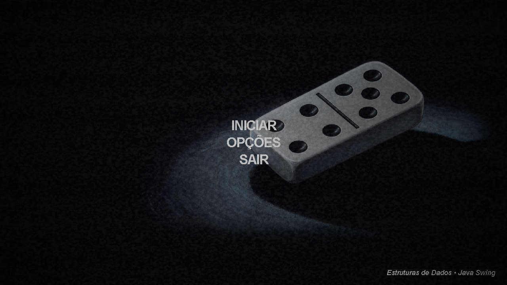
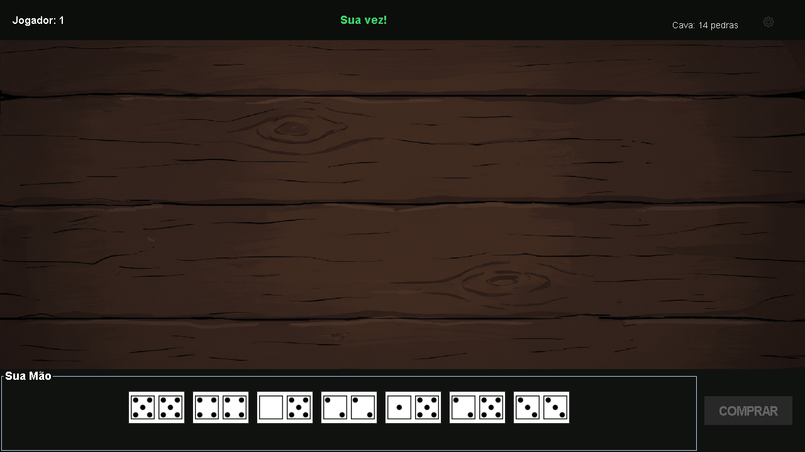

# Lista Circular para Controle de Turnos do Jogo de Dominó

Projeto em Java que simula o controle de turnos de um jogo de dominó usando estruturas encadeadas. Cada jogador é representado por um nó, o turno avança de forma circular e as pedras jogadas são armazenadas em uma lista simplesmente encadeada, permitindo inserir jogadas nas duas pontas da mesa.

O projeto foi desenvolvido para a disciplina de Estrutura de Dados e possui duas formas de execução:

- interface gráfica em Java Swing;
- versão console em `src/jogodomino/JogoDomino.java`, com a lista circular montada explicitamente.

## Prints

As imagens abaixo foram geradas a partir da própria interface, sem capturar a barra inferior do Windows.

### Tela inicial


### Menu principal



### Partida



## Objetivo

Simular um sistema de turnos para jogadores de dominó aplicando listas encadeadas:

- cada nó representa um jogador;
- o último jogador aponta novamente para o primeiro, formando uma lista circular;
- o turno passa circularmente entre os jogadores;
- o controle de jogadores deve permitir adicionar e remover jogadores antes da partida;
- o jogo permite partidas com 2, 3 ou 4 jogadores;
- a quantidade máxima de jogadores é 4;
- as pedras jogadas são guardadas em uma lista simplesmente encadeada;
- cada jogada pode ser inserida no início ou no fim da lista da mesa, representando as duas pontas do dominó.

Observação: uma lista circular encadeada acontece quando o último nó da lista aponta de volta para o primeiro nó, permitindo percorrer os jogadores continuamente.

## Estruturas de Dados

### Lista circular de jogadores

Na versão console, os jogadores são organizados com `Node<Jogador2>`. Depois de criar todos os jogadores, o último nó recebe como próximo o primeiro jogador:

```java
atual.setNext(primeiroJogador);
```

Com isso, o turno avança sempre com:

```java
turnoAtual = turnoAtual.getNext();
```

Quando o jogador 4 termina, por exemplo, o próximo volta a ser o jogador 1.

### Lista simplesmente encadeada da mesa

A mesa usa a classe `Lista<Pedras2>`. Ela guarda as pedras jogadas em ordem e permite inserir nas duas pontas:

```java
mesa.addInicio(pedra);
mesa.addFim(pedra);
```

Isso representa as jogadas feitas na ponta esquerda ou na ponta direita da mesa.

## Funcionalidades

- escolha de 2, 3 ou 4 jogadores;
- distribuição inicial de 7 pedras para cada jogador;
- controle de turnos entre os jogadores;
- compra de pedras quando ainda há peças disponíveis na cava;
- passagem automática de turno quando o jogador não pode jogar;
- detecção de vitória;
- detecção de jogo trancado;
- cálculo da pontuação restante;
- regra de duplas em partidas com 4 jogadores;
- histórico das jogadas em XML;
- interface gráfica com imagens e sons.

## Estrutura do Projeto

```text
.
|-- Main.java                    # Versão simples em console
|-- README.md
|-- docs/
|   |-- prints/                  # Prints da interface
|   `-- slide/                   # Material de apresentação
`-- src/
    |-- Main.java                # Main da interface Swing
    |-- build.bat                # Compila e executa no Windows
    |-- historico.xml
    |-- images/                  # Imagens da interface e das pedras
    |-- sounds/                  # Sons do jogo
    |-- jogodomino/
    |   `-- JogoDomino.java      # Versão console com lista circular
    |-- util/
    |   |-- Cava.java
    |   |-- Jogador2.java
    |   |-- Lista.java
    |   |-- Node.java
    |   |-- Pedras2.java
    |   |-- ResourceLoader.java
    |   |-- ScreenshotGenerator.java
    |   `-- SoundPlayer.java
    `-- view/
        |-- MainFrame.java
        |-- MenuPanel.java
        |-- PreTelaPanel.java
        |-- JanelaJogo.java
        |-- PainelMesa.java
        |-- PainelMao.java
        `-- PainelStatus.java
```

## Como Executar

### Pelo Windows PowerShell

Entre na pasta `src` e rode:

```powershell
.\build.bat
```

O script compila as classes, copia imagens e sons para `out/` e inicia o jogo.

### Compilando manualmente

```powershell
cd src
javac -d out Main.java util\*.java view\*.java jogodomino\*.java
java -cp out Main
```

### Pelo VS Code

1. Abra a pasta do projeto.
2. Abra `src/Main.java`.
3. Clique em **Run** ou pressione `F5`.

A configuração de execução em `src/.vscode/launch.json` aponta para a classe `Main`.

## Como Gerar os Prints

Os prints usados neste README podem ser recriados com:

```powershell
cd src
javac -d out Main.java util\*.java view\*.java jogodomino\*.java
java -cp out util.ScreenshotGenerator
```

As imagens são salvas em `docs/prints/` no tamanho `1280x720`, sem incluir a barra inferior do Windows.

## Principais Classes

| Classe | Papel |
|---|---|
| `Node<T>` | Nó genérico com valor e referência para o próximo nó |
| `Lista<T>` | Lista encadeada usada para mesa e jogadores |
| `Jogador2` | Representa um jogador e suas pedras |
| `Pedras2` | Representa uma pedra de dominó |
| `Cava` | Cria e controla as 28 pedras do jogo |
| `JogoDomino` | Versão console com turnos em lista circular |
| `JanelaJogo` | Controla a partida na interface Swing |
| `PainelMesa` | Desenha a mesa e as pedras jogadas |
| `PainelMao` | Mostra as pedras do jogador atual |

## Autores

- Benjamin da Conceição Neves Cardoso
- Caio Conceição dos Santos
- Daniel Bezerra Medeiros de Souza
- Daniel José Cerqueira Brito
- Jessé dos Santos Nery
- João Pedro Carneiro da Silva
